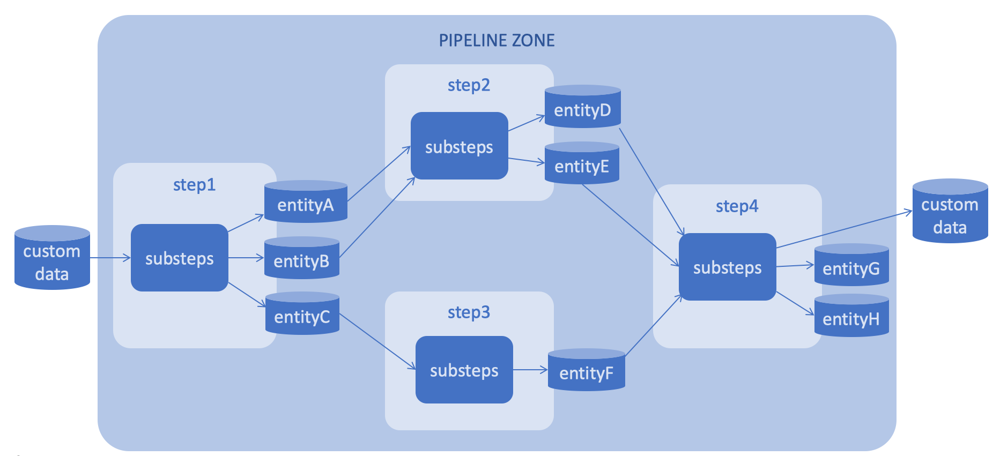

# How it works

Prerequisites

- Jupyter notebook server is up and running

# Pipeline quiсk conceptual intro
Our framework allows you to create and visualize ML pipelines. They consist of steps. Another word, each element of the DAG is a step. At the output and at the input of each step we have entities. An entity is a dataset that is saved in the file system folder as a parquet file. Each step (component) of the pipeline is implemented as a separate Git repository. Each step is created based on a template.

ML pipeline example is shown at the picture below:



Each step is implemented as a sequence of substeps (Jupyter notebooks). Each Jupyter notebook that implements the substep contains 2 special cells at the beginning: 
1. a cell with parameters;
2. a cell with an interface. 

And the interface is a description of the inputs and outputs (entities).

# ML pipeline tutorial

To implement the pipeline in the picture above, please follow these steps:

1. Open Jupyter Notebook Server at http://127.0.0.1:8888/lab in any browser<br>
2. Clone Sinara internal tools repo:
```
git clone https://github.com/4-DS/sinara-int-tools.git
```
3. Automatically create your pipeline structure in GitHub with as many steps as you want.
```
bash create_pipeline.sh
``` 
4. Go to steps folders and define interfaces:


5. Define a step name for each repository:


6. Build design of your ML pipeline:
Open ```visualize.ipynb``` notebook and replace an example step folder glob inside visualize() function call to your actual steps folder glob<br>
Run ```visualize.ipynb``` notebook

Also, you can try a ready example:

1. Clone the ready repos:
```
git clone --recursive https://github.com/4-DS/pipeline-step1.git
git clone --recursive https://github.com/4-DS/pipeline-step2.git
git clone --recursive https://github.com/4-DS/pipeline-step3.git
git clone --recursive https://github.com/4-DS/pipeline-step4.git
```

2. Open ```visualize.ipynb``` from sinara-int-tools repository
3. Change glob path in visualize() to the folder where steps are cloned
4. Run the notebook cells